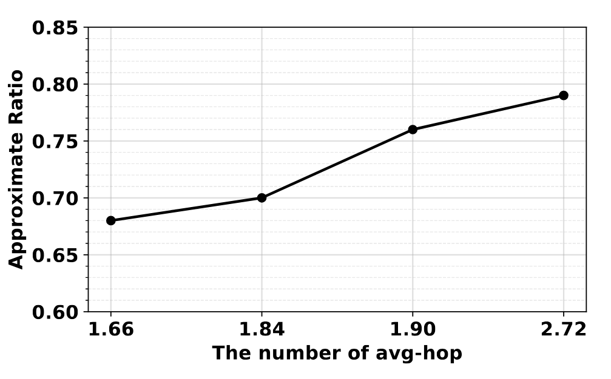
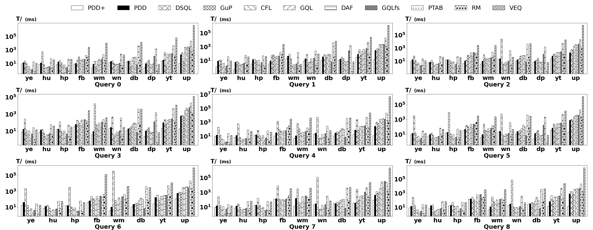
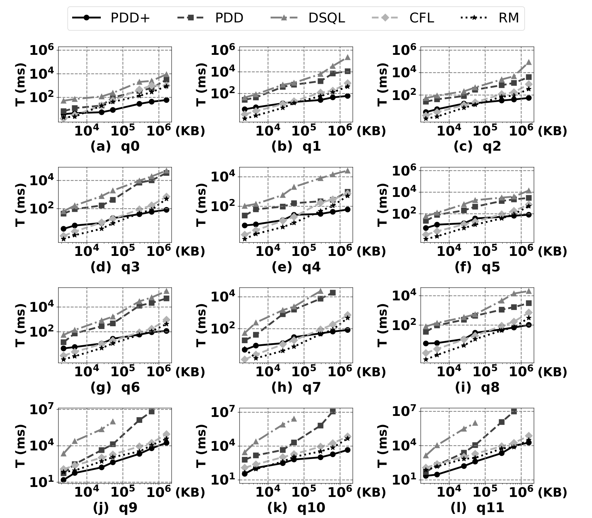
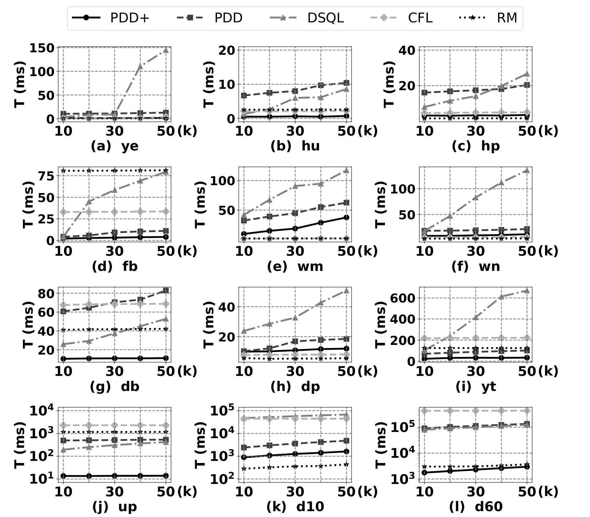

# Technical Report for "Efficient Partition-based Approaches for Diversified Top-k Subgraph Matching"
## Proof of Theorem 1: "*Finding the top-k subgraph matches that maximize distance-based diversity is NP-Hard, even when all subgraph matches are pre-computed.*"
We assume that all subgraph matches of query $Q$ in data graph $G$ have already been computed, forming the candidate set $\mathcal{R}$. We reduce from the classical <u>Max–Min k-Dispersion</u> problem, which is known to be NP-hard on metric inputs <a href="#ref1">[1]</a>. 

**<u>Max–Min k-Dispersion.</u>**
Given a finite point set $P = \{p_1, \dots, p_n\}$ and a distance function $d: P \times P \to \mathbb{R}_{\ge 0}$ that is non-negative, symmetric, and satisfies $d(p,p)=0$ (and possibly the triangle inequality), and a parameter $k \le n$, the goal is to find a subset

$$
S^{\ast} \subseteq P, |S^{\ast}| = k,\text{that maximizes} \min_{u \ne v \in S^{\ast}} d(u, v).
$$

**<u>Reduction construction.</u>**
Let $(P, d, k)$ be an arbitrary instance of Max–Min Dispersion.
- Data graph. For each point $p_i \in P$, create a vertex $v_i$.
    Construct a complete undirected graph $G = (V,E)$ over $\{v_1, \dots, v_n\}$,and set the weight of each edge $(v_i, v_j)$ to $d(p_i, p_j)$.Because $d$ satisfies the triangle inequality, the shortest-path distance between $v_i$ and $v_j$ in $G$ equals $d(p_i, p_j)$.
- Query and matches. Let $Q$ be a single isolated vertex. Every $v_i$ is a valid match. Define the candidate set as $\mathcal{R} = \{ \{v_1\}, \dots, \{v_n\} \}$.
- Distance between matches. For any two matches $R_i = \{v_i\}$ and $R_j = \{v_j\}$, define the inter-match distance as

$$
d^*(R_i, R_j) = \mathrm{dist}_G(v_i, v_j) = d(p_i, p_j).
$$

- Objective. The DT*k*SM problem asks to find a subset $S \subseteq \mathcal{R}$ of size $k$ that maximizes the minimum inter-match distance:

$$
\max_{S \subseteq \mathcal{R}, |S|=k} \min_{R_i \ne R_j \in S} d^*(R_i, R_j).
$$

**<u>Equivalence.</u>**
Any solution $S \subseteq \mathcal{R}$ corresponds to a subset $P_S \subseteq P$ of the same size, and since $d^*(R_i, R_j) = d(p_i, p_j)$, the two problems are equivalent.

**<u>Complexity.</u>**
The transformation uses $O(n^2)$ edges and $n$ candidate matches, so its time and space costs are polynomial in $n$. Thus Max–Min Dispersion $\le_P$ DT*k*SM, proving that DT*k*SM is NP-hard.

## Proof of Theorem 3: *Let $G_i$ and $G_j$ be two partitions in the Partition Adjacency Graph (PAG) such that the shortest path between them is $h = d_H(G_i, G_j)$.  Under the specific assumptions, the approximation ratio $\rho$ is bounded by: $\rho\ge \frac{h-1}{h+1}$.

*Assumptions (A1)--(A5).* Throughout, we consider a graph partitioned into disjoint subgraphs (or “partitions”).  We impose the following conditions on each partition $G_k$:
- (A1) <u>Compactness.</u>  Each partition $G_k$ lies within a ball of fixed radius $d$ around its center $c_k$, i.e.,

$$
\max_{x \in G_k}\mathrm{dist}_G(x, c_k) \le d.
$$

- (A2) <u>Uniformity.</u> The radius $d$ in (A1) is the same for all partitions.

- (A3) <u>Boundary thickness.</u> When moving from one partition to the next along a path in the Partition Adjacency Graph (PAG), any path that crosses an internal boundary must travel at least $2d$.

- (A4) <u>Filtering success.</u> After a filtering stage, every retained partition contains at least one valid match; that is, partitions selected by the algorithm are not dead ends.

- (A5) <u>Match in the partition.</u> 
For analysis, we only consider matches that are fully contained within a single partition.

**Definition 1 (approximation ratio).**
For distance-based diversity, the approximation ratio is defined by

$$
\rho = \frac{D_{\mathrm{alg}}}{D^*},
$$

where $D_{\mathrm{alg}}$ is the distance-based diversity achieved by the algorithm and $D^*$ is the optimal distance-based diversity.

**Lemma 1 (Distance envelope)**.
Let $G_i$ and $G_j$ be partitions whose hop distance in the PAG is $h=d_H(G_i,G_j)$.  Under (A1) and (A2), the true distance between any vertices $u\in G_i$ and $v\in G_j$ satisfies

$$
2(h-1)d \le \mathrm{dist}_G(u,v) \le 2(h+1)d.
$$

**Theorem 3 (Approximation ratio).**
Let $G_i$ and $G_j$ be the pair of partitions selected by the algorithm as the farthest in the PAG, with hop distance $h=d_H(G_i,G_j)$.  Under assumptions (A1)–(A4) and the boundary thickness (A3) for the lower bound, the approximation ratio defined in Definition 1 satisfies

$$
\frac{h-1}{h+1} \le \rho \le 1.
$$

**Proof.**
Since the ratio is defined by $\rho = D_{\mathrm{alg}}/D^*$, it is immediate that $\rho \le 1$, because $D_{\mathrm{alg}}$ cannot exceed $D^*$. For the lower bound, consider the partitions $G_i$ and $G_j$ with hop distance $h$.  Lemma 1 gives

$$
2(h-1)d \le \mathrm{dist}_G(u,v)\le 2(h+1)d
$$

for $u\in G_i$, $v\in G_j$. The algorithm selects a pair that realizes the left-hand (worst-case) bound, so its achieved diversity is $D_{\mathrm{alg}} \ge 2(h-1)d$. On the other hand, an optimal solution cannot exceed the right-hand bound, hence $D^*\le 2(h+1)d$.  Therefore

$$
\rho = \frac{D_{\mathrm{alg}}}{D^*} \ge \frac{2(h-1)d}{2(h+1)d} = \frac{h-1}{h+1},
$$

proving the stated bounds on $\rho$.

The lower bound $\tfrac{h-1}{h+1}$ increases with $h$ and approaches $1$ as $h\to\infty$, meaning that for partitions far apart in the PAG, the approximation ratio becomes arbitrarily close to one.

**remark.**
Firstly, although Theorem 1 (in the full paper) is stated for pairwise distances, it naturally extends to the top-$k$ setting. Specifically, every pair among the $k$ selected matches must satisfy the same lower bound. In addition, since we do not select adjacent partitions, the $h$-hop distance between any two chosen partitions in the PAG is always at least 2. Furthermore, when the partition size decreases, the number of partitions increases, which makes it easier to select non-adjacent partitions that are farther apart in the PAG. As a result, the minimum inter-partition hop $h$ tends to grow, thereby improving the lower bound of distance diversity (cf. Theorem 1 in the full paper). However, the partition size cannot be arbitrarily small. As illustrated in Experiment 1, when the partition size falls below the range of 1000–2000 vertices, the execution time increases because boundary vertex replication grows, leading to more cross-partition matches. Hence, there exists a clear trade-off between distance diversity (which benefits from larger $h$) and execution time (which deteriorates when the partition size is too small).

 Varied the relationship between approximate ratio and hop distance 

## Detailed Experimental Results

 Runtime of Different Query on Different Real-World Datasets (k = 30) 

  Runtime Variation with Data Size (k = 30) 

  Runtime Variation with k for Query q1 

## References

[1] 1994. Heuristic and Special Case Algorithms for Dispersion Problems. Oper. Res.42, 2 (April 1994), 299–310. https://doi.org/10.1287/opre.42.2.299

